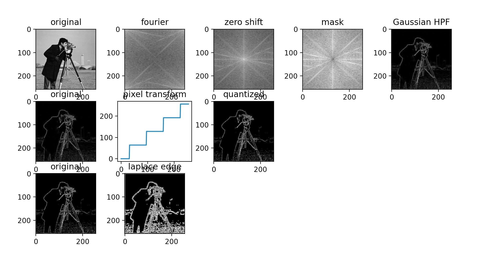

# ImageProcessor

A digitial image processing visualizer with various filters and tools implmented with `numpy` and `Tkinter`.

# Purpose
Project done to practice skills learned while taking a Digital Image Processing course by Northwestern University on Coursera.

# Usage
When you run the program, you have the option to add a filter. Then you can select a filter with the drop down and modify certain parameters related to the filter (explained in the help button). Then You can choose to apply that filter or not (not doing it will skip it). You can also choose to use previous image (from the filter before) or the original image as an input. Here is a gif to see how it works.

# Output
Each filter gets it's own row with images in the middle showing how the final filter image was created. For example, for Gaussian blurs, you can see the Fourier Transform then the filter applied to kill low frequiences, then an inverse transform to get the filtered image.

Here is an example output.

